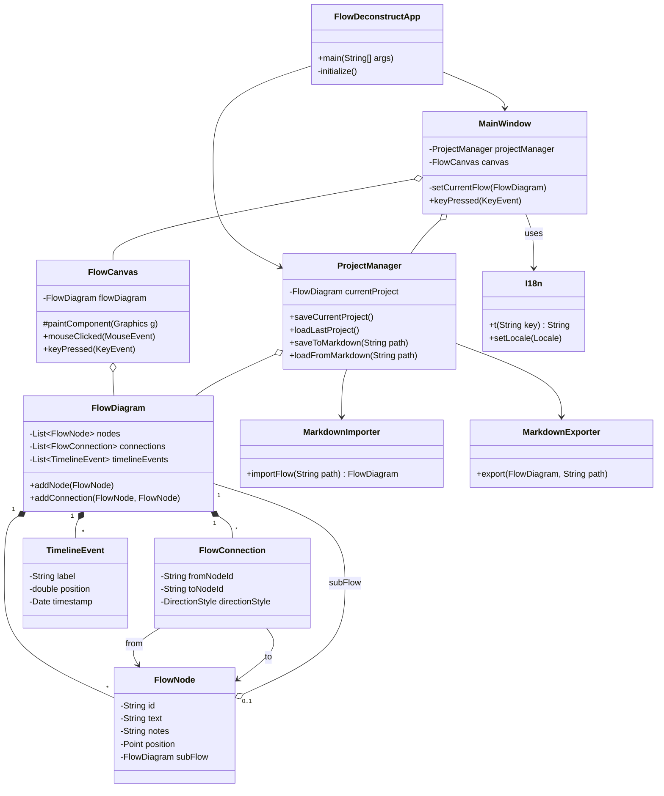

# Análise Completa e Documentação do Projeto: FlowDeconstruct

Este documento fornece uma análise detalhada do aplicativo FlowDeconstruct, incluindo o Documento de Requisitos do Produto (PRD), a arquitetura do software, um diagrama de classes Mermaid e um guia para futuras manutenções e desenvolvimentos, com foco em internacionalização.

---

## 1. Product Requirements Document (PRD)

### 1.1. Visão Geral
**Produto:** FlowDeconstruct
**Descrição:** Uma ferramenta de desktop ultrarrápida para mapeamento de fluxos hierárquicos, projetada para especialistas de triagem técnica e analistas de sistemas.
**Público-alvo:** Engenheiros de software, analistas de suporte (como SAP Mission Critical Center), arquitetos de solução e qualquer profissional que precise documentar e entender rapidamente fluxos de processos complexos.

### 1.2. Problema
Especialistas técnicos frequentemente lidam com sistemas complexos e distribuídos. Durante uma triagem de incidente ou uma análise de arquitetura, é crucial mapear visualmente o fluxo de informações, as dependências entre componentes e a sequência de eventos. Ferramentas tradicionais (como editores de diagrama genéricos) podem ser lentas, complexas e não otimizadas para um fluxo de trabalho rápido e focado no teclado. Falta uma ferramenta que permita a criação de diagramas de fluxo de forma ágil, quase como se estivesse escrevendo notas, com persistência local e fácil exportação.

### 1.3. Objetivos e Funcionalidades

#### 1.3.1. Mapeamento de Fluxo Rápido e Intuitivo
- **Criação de Nós via Teclado:** O usuário deve poder criar nós (caixas) no fluxo com um simples comando de teclado (ex: `Tab`), permitindo a digitação imediata do texto do nó.
- **Navegação e Conexão via Teclado:** A navegação entre os nós e a criação de conexões devem ser primariamente controladas pelo teclado para maximizar a velocidade.
- **Manipulação via Mouse:** Embora o foco seja no teclado, o usuário deve poder mover nós, fazer panorâmica (pan) e zoom no canvas com o mouse.

#### 1.3.2. Hierarquia e Detalhamento
- **Subfluxos:** Cada nó no diagrama deve poder conter um subfluxo (um diagrama filho), permitindo a decomposição de etapas complexas em níveis de detalhe menores.
- **Anotações:** O usuário deve poder adicionar notas de texto detalhadas a cada nó, que podem ser incluídas ou omitidas na exportação.

#### 1.3.3. Visualização e Customização
- **Canvas "Infinito":** A área de desenho deve ser grande e expansível, dando a sensação de um espaço de trabalho ilimitado.
- **Customização Visual:** Nós e conexões devem ter propriedades customizáveis, como cor de preenchimento, cor da borda, formato do nó (retângulo, diamante, etc.) e estilo do texto.
- **Timeline View:** Uma visão alternativa de "linha do tempo" deve permitir que os eventos do fluxo sejam organizados cronologicamente ou em uma sequência lógica.

#### 1.3.4. Persistência e Portabilidade
- **Salvamento Automático Local:** O projeto atual deve ser salvo automaticamente em um diretório de dados do aplicativo local, sem que o usuário precise se preocupar em salvar manualmente. O aplicativo deve carregar o último projeto ao iniciar.
- **Importação/Exportação em Markdown:** O formato principal para compartilhamento e versionamento deve ser um esquema de Markdown bem definido. Isso permite que os diagramas sejam facilmente lidos, editados em qualquer editor de texto e versionados no Git.
- **Exportação para PDF:** (Funcionalidade futura/desejada) Exportar a visualização do diagrama para um arquivo PDF para compartilhamento com stakeholders não-técnicos.

#### 1.3.5. Integração com IA
- **Prompt a partir de Transcrição:** O aplicativo deve fornecer uma funcionalidade para gerar um prompt estruturado a partir de uma transcrição de texto livre. Este prompt, quando usado em um Modelo de Linguagem Grande (LLM), pode gerar o arquivo Markdown do diagrama, automatizando a criação inicial do fluxo.

#### 1.3.6. Internacionalização (i18n)
- **Suporte a Múltiplos Idiomas:** A interface do usuário (UI) deve ser traduzível. O aplicativo já suporta Inglês, Português (Brasil) e Espanhol, e deve ser fácil adicionar novos idiomas.

---

## 2. Arquitetura e Esquema Detalhado

O FlowDeconstruct segue uma arquitetura que se assemelha ao padrão Model-View-Controller (MVC), adaptada para uma aplicação desktop Swing.

### 2.1. Estrutura de Pacotes

- **`com.sap.flowdeconstruct`**: Pacote raiz, contém a classe de entrada da aplicação.
- **`com.sap.flowdeconstruct.ai`**: Lógica para integração com IA.
- **`com.sap.flowdeconstruct.core`**: Gerenciamento central do ciclo de vida do projeto.
- **`com.sap.flowdeconstruct.export`**: Lógica para exportar diagramas.
- **`com.sap.flowdeconstruct.importer`**: Lógica para importar diagramas.
- **`com.sap.flowdeconstruct.i18n`**: Gerenciamento de internacionalização.
- **`com.sap.flowdeconstruct.model`**: As classes de dados que representam o diagrama.
- **`com.sap.flowdeconstruct.ui`**: Todos os componentes visuais (janelas, diálogos, canvas).

### 2.2. Detalhamento das Classes Principais

#### Pacote `model` (O Coração dos Dados)
- **`FlowDiagram.java`**: Representa um diagrama completo. Contém uma lista de `FlowNode` e `FlowConnection`. É a classe raiz de um projeto. Também gerencia o estado da UI, como o nó selecionado.
- **`FlowNode.java`**: Representa uma "caixinha" no diagrama. Possui propriedades como texto, notas, posição, tamanho, cores, formato e, crucialmente, pode conter um `FlowDiagram` aninhado (o subfluxo).
- **`FlowConnection.java`**: Representa a linha que conecta dois `FlowNode`. Armazena os IDs dos nós de origem e destino e propriedades como tipo de direção e protocolo.
- **`TimelineEvent.java`**: Representa um evento na visão de linha do tempo, associado a uma posição lógica e um rótulo.

#### Pacote `core` (Gerenciamento Central)
- **`ProjectManager.java`**: Classe vital que gerencia a persistência. É responsável por:
    - Salvar e carregar projetos em formato JSON (`.flowproj`) no diretório de dados do usuário.
    - Implementar o salvamento automático.
    - Carregar o último projeto aberto.
    - Orquestrar a importação e exportação de/para Markdown, utilizando o `MarkdownImporter` e `MarkdownExporter`.

#### Pacote `ui` (A Interface com o Usuário)
- **`FlowDeconstructApp.java`**: O ponto de entrada (`main`). Inicializa o Look and Feel do Swing, o `ProjectManager`, a `MainWindow` e o `SystemTrayManager`.
- **`MainWindow.java`**: A janela principal da aplicação. Contém o menu, a barra de ferramentas e o `FlowCanvas`. Captura os eventos de teclado de alto nível e coordena as ações do usuário.
- **`FlowCanvas.java`**: O componente mais complexo da UI. É um `JPanel` customizado responsável por:
    - Desenhar os nós, conexões e a linha do tempo.
    - Lidar com toda a interação do mouse (cliques, arrastar, zoom).
    - Gerenciar o estado de edição de texto dentro de um nó.
    - Exibir menus de contexto para customização de nós e conexões.
- **`SystemTrayManager.java`**: Gerencia o ícone na bandeja do sistema, o menu de contexto e as notificações.
- **Subpacote `dialogs`**: Contém todas as janelas de diálogo, como `SettingsDialog` (para mudar idioma), `ExportDialog`, `ImportDialog`, `NoteDialog` (para editar notas), etc.

#### Pacotes `importer` e `export`
- **`MarkdownImporter.java`**: Contém a lógica para parsear um arquivo `.md` (usando a biblioteca `commonmark`) e construir um objeto `FlowDiagram` a partir dele. É robusto para lidar com diferentes formatos de atributos (posição, cor, etc.).
- **`MarkdownExporter.java`**: Gera uma representação textual de um `FlowDiagram` no formato Markdown customizado, que pode ser salvo em um arquivo `.md`.

#### Pacote `ai`
- **`PromptBuilder.java`**: Uma classe simples que constrói um prompt detalhado. O prompt instrui um LLM a converter uma transcrição de texto em um arquivo Markdown que o `MarkdownImporter` possa entender.

#### Pacote `i18n`
- **`I18n.java`**: Gerenciador estático de internacionalização. Carrega os `ResourceBundle` (arquivos `.properties`) com base no Locale selecionado pelo usuário, que é salvo nas preferências. Fornece o método `I18n.t("key")` para obter as strings traduzidas.

---

## 3. Diagrama de Classes (Mermaid)

Este diagrama ilustra as principais relações entre as classes do sistema.



---

## 4. Guia de Desenvolvimento e Internacionalização (i18n)

### 4.1. Como Adicionar um Novo Idioma

O processo é simples e centralizado no pacote `i18n` e nos arquivos de recursos.

**Exemplo: Adicionando Francês (fr)**

1.  **Crie o Arquivo de Propriedades:**
    - No diretório `src/main/resources`, crie uma cópia de `messages_en.properties`.
    - Renomeie a cópia para `messages_fr.properties`.

2.  **Traduza as Strings:**
    - Abra `messages_fr.properties` em um editor de texto.
    - Traduza os valores de cada chave para o francês. Por exemplo:
      ```properties
      # Original em messages_en.properties
      menu.file=File
      
      # Traduzido em messages_fr.properties
      menu.file=Fichier
      ```

3.  **Adicione a Opção na UI:**
    - Abra a classe `src/main/java/com/sap/flowdeconstruct/ui/dialogs/SettingsDialog.java`.
    - No método `createComponents()`, adicione o novo idioma à `languageComboBox`:
      ```java
      // ... (outras línguas)
      languageComboBox.addItem(new LanguageItem(new Locale("es", "ES"), I18n.t("settings.lang.es")));
      // Adicione a nova linha para o francês
      languageComboBox.addItem(new LanguageItem(new Locale("fr"), I18n.t("settings.lang.fr")));
      ```

4.  **Adicione a Chave de Tradução para o Nome do Idioma:**
    - Em **todos** os arquivos `messages_xx.properties`, adicione a chave para o nome do novo idioma, para que ele apareça corretamente na lista de seleção, independentemente do idioma atual.
      - `messages_en.properties`: `settings.lang.fr=French`
      - `messages_pt_BR.properties`: `settings.lang.fr=Francês`
      - `messages_es.properties`: `settings.lang.fr=Francés`
      - `messages_fr.properties`: `settings.lang.fr=Français`

5.  **Compile e Execute:**
    - O novo idioma agora estará disponível na janela de Configurações.

### 4.2. Como Usar Strings Traduzidas no Código

- Para qualquer texto visível para o usuário na UI, sempre use o método `I18n.t()`.
- **Exemplo:**
  ```java
  // Ruim (hardcoded):
  JButton myButton = new JButton("Save");

  // Bom (internacionalizado):
  JButton myButton = new JButton(I18n.t("dialog.save")); // "dialog.save" é uma chave nos .properties
  ```

### 4.3. Próximos Passos e Melhorias Sugeridas

- **Implementar Exportação para PDF:** A dependência `itext7-core` já está no `pom.xml`, mas a lógica de exportação precisa ser criada. Uma nova classe `PdfExporter` no pacote `export` seria o ideal.
- **Refatorar o Tratamento de Eventos:** A lógica de teclado está um pouco espalhada entre `MainWindow` e `FlowCanvas`. Centralizar isso em um `InputManager` poderia limpar o código.
- **Melhorar o Auto-Layout:** O layout automático atual é uma grade simples. Algoritmos mais sofisticados (ex: layout de grafo direcionado) poderiam ser implementados para organizar os nós de forma mais inteligente.
- **Testes de Unidade:** O projeto tem uma estrutura de testes, mas a cobertura pode ser expandida, especialmente para a lógica de importação/exportação e para o `ProjectManager`.

