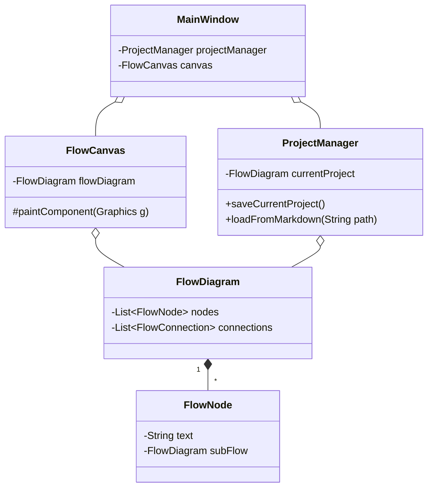

# Guia do Desenvolvedor - FlowDeconstruct

## 1. Introdução

Bem-vindo ao FlowDeconstruct! Este guia é o ponto de partida central para desenvolvedores que desejam entender, manter e estender o projeto.

**O que é o FlowDeconstruct?**

É uma ferramenta de desktop ultrarrápida para mapeamento de fluxos hierárquicos, construída em Java Swing. O objetivo é permitir que especialistas de triagem técnica criem e visualizem fluxos de processos complexos com máxima velocidade, priorizando interações via teclado.

Para uma visão detalhada do produto, seus requisitos e público-alvo, consulte o [Documento de Análise Completa](ANALISE_COMPLETA_PROJETO.md).

## 2. Configuração do Ambiente

1.  **Java Development Kit (JDK):** O projeto é construído com **Java 8**. Você precisará de um JDK compatível (ex: OpenJDK 8, Oracle JDK 8, ou o SAP JVM 8 especificado no `pom.xml`).
2.  **Maven:** O projeto usa o Apache Maven para gerenciamento de dependências e build. Certifique-se de que o Maven esteja instalado e configurado no seu PATH.
3.  **IDE:** Qualquer IDE Java moderna funcionará (ex: IntelliJ IDEA, Eclipse, VS Code com extensões Java).

### Comandos Essenciais

-   **Instalar dependências e compilar o projeto:**
    ```sh
    mvn clean install
    ```
-   **Compilar e empacotar em um JAR executável:**
    ```sh
    mvn clean package
    ```
    O JAR final (ex: `FlowDeconstruct.jar`) estará no diretório `target/`.

-   **Executar os testes:**
    ```sh
    mvn test
    ```

-   **Executar a aplicação diretamente via Maven:**
    ```sh
    mvn exec:java
    ```

## 3. Arquitetura do Código

A arquitetura do projeto segue um padrão semelhante ao Model-View-Controller (MVC).

### 3.1. Estrutura de Pacotes

-   `com.sap.flowdeconstruct.model`: As classes de dados (POJOs) que representam o diagrama (`FlowDiagram`, `FlowNode`, etc.).
-   `com.sap.flowdeconstruct.ui`: Todos os componentes visuais Swing (`MainWindow`, `FlowCanvas`, diálogos).
-   `com.sap.flowdeconstruct.core`: Lógica de negócio central, principalmente o `ProjectManager` que lida com a persistência.
-   `com.sap.flowdeconstruct.export` / `importer`: Lógica para converter o modelo de/para o formato Markdown.
-   `com.sap.flowdeconstruct.i18n`: Gerenciamento de internacionalização.
-   `com.sap.flowdeconstruct.ai`: Lógica para construção de prompts para LLMs.
-   `com.sap.flowdeconstruct.actions`: (Proposto) Classes que encapsulam ações do usuário (Padrão Command).

### 3.2. Diagrama de Classes



### 3.3. Decisões de Arquitetura (ADRs)

Para entender o *porquê* por trás das escolhas tecnológicas (Swing, Markdown, etc.), consulte os **Registros de Decisão de Arquitetura** na pasta [`docs/adr/`](docs/adr/).

## 4. Fluxos de Trabalho Comuns

### Como Adicionar um Novo Idioma

O processo é detalhado na [seção de i18n da análise completa](ANALISE_COMPLETA_PROJETO.md#4-guia-de-desenvolvimento-e-internacionaliza%C3%A7%C3%A3o-i18n).

1.  Crie um novo arquivo `messages_xx.properties` em `src/main/resources`.
2.  Traduza as chaves.
3.  Adicione a nova opção de idioma no `SettingsDialog.java`.
4.  Adicione a chave de tradução para o nome do novo idioma em todos os arquivos de mensagens.

### Como Adicionar um Novo Atalho de Teclado

O sistema de input está sendo refatorado para um modelo mais robusto. Consulte o [Plano de Refatoração do Gerenciamento de Input](docs/REFACTOR-INPUT-HANDLING.md) para detalhes. O fluxo de trabalho ideal é:

1.  Crie uma nova classe que implemente a interface `Command` no pacote `actions`.
2.  Coloque a lógica da ação dentro do método `execute()`.
3.  Registre um `KeyStroke` e sua `Action` correspondente no `InputManager`, que instanciará e executará seu novo comando.

## 5. Testes

Testes são cruciais para a estabilidade do projeto. A estratégia completa está documentada no [Plano de Testes Abrangente](docs/TEST-PLAN.md).

-   **Executar todos os testes:** `mvn test`
-   **Teste Mais Importante:** `MarkdownRoundtripTest`. Este teste garante que a exportação e importação de um diagrama não corrompem ou perdem dados. **Ao adicionar qualquer propriedade persistente a um nó ou conexão, este teste deve ser atualizado** para verificar a nova propriedade.

## 6. Roadmap de Desenvolvimento

Os seguintes documentos na pasta `docs/` descrevem as próximas grandes iniciativas de desenvolvimento e refatoração. Consulte-os antes de iniciar uma nova feature.

-   **[FEATURE-PLAN-PDF-EXPORT.md](docs/FEATURE-PLAN-PDF-EXPORT.md):** Plano técnico para implementar a exportação de diagramas para PDF.
-   **[UI-UX-REFINEMENT-PLAN.md](docs/UI-UX-REFINEMENT-PLAN.md):** Plano para refatorar e modernizar a UI, focando na centralização de estilos e consistência de layouts.
-   **[REFACTOR-INPUT-HANDLING.md](docs/REFACTOR-INPUT-HANDLING.md):** Plano para centralizar o gerenciamento de eventos de teclado e mouse usando o padrão Command.
